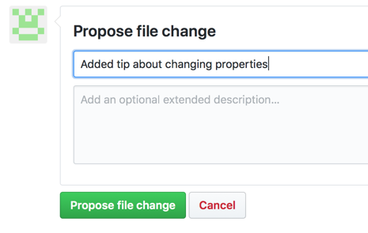
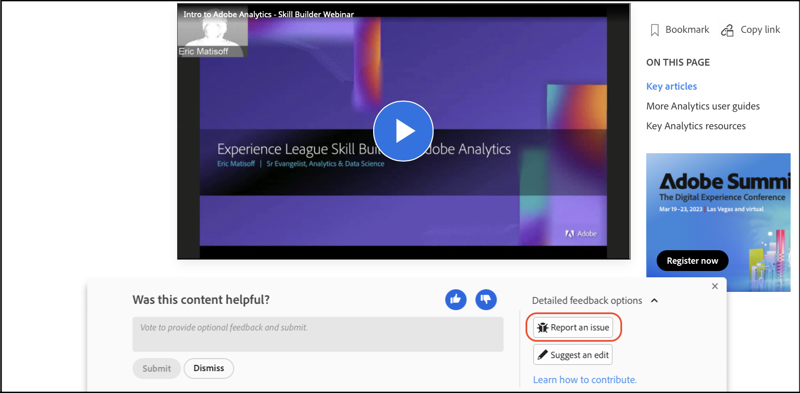

# Guida per chi contribuisce alla documentazione Adobe

Questa guida descrive come contribuire alla documentazione Adobe Enterprise su Experience League.

## Cos’è la documentazione collaborativa?

La documentazione tecnica e i contenuti di abilitazione per Adobe Experience Cloud e altri prodotti Adobe Enterprise si basano sui principi open source e utilizzano GitHub, Markdown e le soluzioni Adobe Experience Cloud.

Questo modello open source migliora la qualità dei contenuti e la comunicazione tra clienti, team di documentazione e team di prodotto. In ogni pagina è ora possibile valutare l’utilità dei contenuti, segnalare eventuali problemi e persino contribuire con suggerimenti di contenuti, come le richieste pull di Git (PR). I team di documentazione Adobe controllano i contributi e i problemi segnalati su base giornaliera ed effettuano aggiornamenti, modifiche e regolazioni, a seconda delle necessità.

## Utilizzo della documentazione collaborativa

Come utente di questo materiale, a prescindere che tu sia un dipendente, un partner, un cliente o un potenziale cliente, hai la possibilità di contribuire a questa documentazione in diversi semplici modi.

* Valuta l’utilità della pagina ❶ e scrivi un commento opzionale ❷
* Segnala un problema relativo a una pagina specifica (richiede l’accesso Git) ❸
* Inoltra una modifica rapida creando interi articoli, completi di risorse ed esempi di codice (richiede l’accesso Git) ❹

Queste opzioni vengono visualizzate nella parte inferiore della pagina pochi secondi dopo l’apertura. Se salti l’area di feedback, puoi ricaricare la pagina per riportarla indietro.

Questa guida delinea tutti gli elementi necessari per interagire con e contribuire a questo materiale.

<!--
>[!IMPORTANT]
>All repositories that publish to docs.adobe.com have adopted the [Adobe Open Source Code of Conduct](../code-of-conduct.md) or the [.NET Foundation Code of Conduct](https://dotnetfoundation.org/code-of-conduct). For more information, see the [Contributing](../contributing.md) article.
>
> Minor corrections or clarifications to documentation and code examples in public repositories are covered by the [Adobe Documentation Terms of Use](https://www.adobe.com/legal/terms.html). New or significant changes generate a comment in the pull request, asking you to submit an online Contribution License Agreement (CLA) if you are not an employee of Adobe. We need you to complete the online form before we can review or accept your pull request.
-->

## Valutare l’utilità della pagina e scrivi un commento

Alcuni secondi dopo l’apertura di una pagina, nella parte inferiore della pagina viene visualizzata un’area di feedback. Fai clic in alto o in basso per indicare se la pagina è stata utile.

Puoi lasciare un commento per fornire un feedback aggiuntivo.

## Apportare modifiche rapide ai documenti esistenti

Per fornire un feedback più dettagliato, apportare modifiche rapide è un buon modo per correggere piccoli errori e omissioni nei documenti. Per suggerire una modifica, invia una richiesta pull (PR) per inviare la correzione o il suggerimento, che potrà così essere esaminato, approvato e pubblicato.

1. Firma il [Contratto di licenza da collaboratore (CLA)](http://opensource.adobe.com/cla.html), se accettabile.

   È necessario inviare un Adobe CLA una sola volta.

1. Nell’area di feedback visualizzata nella parte inferiore dell’articolo, fai clic su **[!UICONTROL Detailed feedback options]**, poi fai clic su **[!UICONTROL Suggest an edit]** per passare al file Markdown di origine su GitHub.

   

1. Fai clic sull’icona della matita per modificare l’articolo.

   >[!NOTE]
   >
   >Se l’icona della matita è disattivata, devi accedere all’account GitHub oppure creare un nuovo account.

   

1. Apporta le modifiche nell’editor Web.

   Puoi fare clic sulla scheda **[!UICONTROL Preview changes]** per controllare la formattazione delle modifiche.

1. Dopo aver apportato le modifiche, scorri fino alla parte inferiore della pagina.

   Immetti un titolo e una descrizione per la tua richiesta pull, quindi fai clic su **[!UICONTROL Propose file change]** come mostrato nella figura seguente:

   

   >[!NOTE]
   >
   >Se ricevi un messaggio di errore di convalida relativo alla firma di un contratto CLA (Contributor License Agreement), fai clic su **[!UICONTROL Details]** per aprire il contratto di licenza. Firma il contratto, se accettabile. Quindi chiudi e apri la richiesta di pull e continua.

Tutto qui. I membri del gruppo della documentazione potranno esaminare e unire la tua richiesta pull. Grazie. 

## Segnalare un problema

Per comunicare facilmente un problema relativo ai contenuti, puoi anche usare la funzione **[!UICONTROL Report an issue]**.

1. Nell’area di feedback visualizzata nella parte inferiore dell’articolo, fai clic su **[!UICONTROL Detailed feedback options]**, poi fai clic su **[!UICONTROL Report an issue]** per passare al file Markdown di origine su GitHub.

   

   >[!NOTE]
   >
   >Per segnalare un problema, è necessario accedere al tuo account GitHub o creare un account.

   Facendo clic su questo collegamento puoi registrare rapidamente una segnalazione per Experience League, mediante l’interfaccia GitHub Issue.

   L’URL della pagina che contiene il problema viene compilato automaticamente nel campo di descrizione.

1. Inserisci il titolo, scrivi una breve descrizione del problema, quindi fai clic su *Submit new issue* (Invia nuovo problema).

   

Quando viene inviato un problema, il team responsabile dei contenuti della pagina in questione riceve una notifica e può quindi intervenire per risolverlo. Una volta aggiornato il contenuto, verrai informato nell’interfaccia GitHub Issues e riceverai una notifica tramite e-mail dopo l’aggiornamento o la chiusura.

## Comprendere le autorizzazioni GitHub

L’interfaccia utente di modifica di GitHub si adatta alle autorizzazioni dell’archivio. Le immagini precedenti sono rese in modo accurato per i collaboratori che non dispongono delle autorizzazioni di scrittura per l’archivio di destinazione. GitHub crea automaticamente un fork dell’archivio di destinazione nell’account. Se disponi di accesso in scrittura per l’archivio di destinazione, GitHub crea un nuovo ramo nell’archivio di destinazione.

Adobe utilizza le richieste di pull per tutte le modifiche, anche per i collaboratori con accesso in scrittura. La maggior parte degli archivi presenta il ramo `main` protetto, perciò gli aggiornamenti devono essere inviati come richieste di pull.

L’esperienza di modifica nel browser è ideale per modifiche minori o non frequenti. Se apporti contributi di grandi dimensioni o utilizzi funzioni Git avanzate, ti consigliamo di [effettuare il forking dell’archivio e lavorare localmente](setup/full-workflow.md).

## Fornire feedback

Con un set di soluzioni quello di Adobe, la documentazione è in continua elaborazione. Se noti degli errori, segnala un problema; se hai suggerimenti sul materiale, comunicali. Indicaci quali informazioni stavi cercando. Comunicaci se non hai trovato ciò di cui avevi bisogno o se hai incontrato difficoltà a completare l’attività; informaci su come possiamo aiutarti a scoprire di più sulle soluzioni.

Grazie da parte del team della documentazione collaborativa e di tutti gli autori e i produttori di contenuti di Experience League.
