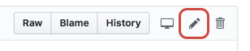

# Panoramica della guida per i collaboratori per la documentazione di Adobe

## Cos’è la documentazione di collaborazione

Durante il 2019, tutta la documentazione tecnica e i contenuti di supporto per Adobe Experience Cloud passeranno a una nuova piattaforma, in base ai principi open source, utilizzando le soluzioni Github, Markdown e Adobe Experience Cloud, inclusi Adobe Experience Manager, Analytics, Launch e Target.

Questo modello open source migliora la qualità dei contenuti e la comunicazione tra clienti, team di documentazione e team di prodotto. In ogni pagina è ora possibile valutare l’utilità dei contenuti, segnalare eventuali problemi e persino contribuire con suggerimenti di contenuti, come le richieste pull di Git (PR). I team di documentazione Adobe controllano i contributi e i problemi segnalati su base giornaliera ed effettuano aggiornamenti, modifiche e regolazioni, a seconda delle necessità.

## Utilizzo della documentazione collaborativa

Come utente di questo materiale, a prescindere che tu sia un dipendente, un partner, un cliente o anche un potenziale cliente, hai la possibilità di contribuire a questa documentazione in diversi semplici modi:

* valutare l’utilità della pagina
* segnalare un problema per a una pagina specifica
* perfino inoltrare una modifica rapida oppure creare interi articoli, completi di risorse ed esempi di codice

Questa guida delinea tutti gli elementi necessari per interagire con e contribuire a questo materiale.

<!--
> [!IMPORTANT]
> All repositories that publish to docs.adobe.com have adopted the [Adobe Open Source Code of Conduct](../code-of-conduct.md) or the [.NET Foundation Code of Conduct](https://dotnetfoundation.org/code-of-conduct). For more information, see the [Contributing](../contributing.md) article.
>
> Minor corrections or clarifications to documentation and code examples in public repositories are covered by the [Adobe Documentation Terms of Use](https://www.adobe.com/legal/terms.html). New or significant changes generate a comment in the pull request, asking you to submit an online Contribution License Agreement (CLA) if you are not an employee of Adobe. We need you to complete the online form before we can review or accept your pull request.
--->

## Apportare modifiche rapide ai documenti esistenti

Apportare delle modifiche rapide è un modo utile per correggere piccoli errori e omissioni nei documenti. Se un articolo visualizza un pulsante di modifica come mostrato di seguito, puoi apportare autonomamente una correzione rapida. Quando modifichi il documento, invii una richiesta di pull (PR) per inviare la correzione o il suggerimento e quest’ultimo può essere esaminato, approvato e pubblicato.

1. Firma il [Contratto di licenza da collaboratore (CLA)](http://opensource.adobe.com/cla.html), se accettabile.

   È necessario inviare un Adobe CLA una sola volta.
1. Fai clic su **`Edit this page`** nella colonna di destra per passare al file Markdown di origine su GitHub.
1. Fai clic sull’icona della matita per modificare l’articolo.

   > [!NOTE]
   > Se l’icona della matita è disattivata, devi accedere all’account GitHub oppure creare un nuovo account.

   

1. Apporta le modifiche nell’editor Web. Puoi fare clic sulla scheda **Preview changes** per controllare la formattazione delle modifiche.
1. Dopo aver apportato le modifiche, scorri fino alla parte inferiore della pagina. Immetti un titolo e una descrizione per la PR e fai clic su **Suggest file change** come mostrato nella figura seguente:

   

   >[!NOTE] Se ricevi un messaggio di errore di convalida, relativo alla firma di un contratto di licenza da collaboratore (CLA), fai clic su **Dettagli** per aprire il contratto di licenza. Firma il contratto, se accettabile. Quindi chiudi e apri la richiesta di pull e continua.

Tutto qui. Grazie. I membri del gruppo della documentazione potranno esaminare e unire la tua richiesta di pull.

## Segnalare un problema

Un altro semplice modo per riportare un problema con dei contenuti è “Segnalare un problema”.

1. Se noti un problema con uno dei contenuti, fai clic sul collegamento `Log an Issue` in basso a destra di qualsiasi pagina. Vedi la figura seguente:

   

   > [!NOTE]
   > Per segnalare un problema dovrai accedere all’account GitHub o creare un nuovo account.

   Facendo clic su questo collegamento, potrai registrare una segnalazione rapida utilizzando l’interfaccia GitHub Issue.

1. L’URL della pagina che contiene il problema viene automaticamente popolato nel campo di descrizione. Inserisci il titolo, scrivi una breve descrizione del problema, quindi fai clic su *Submit new issue*.

   

Quando invii una segnalazione di un problema, il team dei contenuti della pagina in questione viene automaticamente notificato e potrà quindi intervenire. Una volta aggiornato il contenuto, verrai informato nell’interfaccia GitHub Issues e riceverai una notifica tramite e-mail dopo l’aggiornamento o la chiusura.

## Comprendere le autorizzazioni GitHub

L’interfaccia utente di modifica di GitHub si adatta alle autorizzazioni dell’archivio. Le immagini precedenti sono rese in modo accurato per i collaboratori che non dispongono delle autorizzazioni di scrittura per l’archivio di destinazione. GitHub crea automaticamente un fork dell’archivio di destinazione nell’account. Se disponi di accesso in scrittura per l’archivio di destinazione, GitHub crea un nuovo ramo nell’archivio di destinazione.

Adobe utilizza le richieste di pull per tutte le modifiche, anche per i collaboratori con accesso in scrittura. La maggior parte degli archivi presenta il ramo `master` protetto, perciò gli aggiornamenti devono essere inviati come richieste di pull.

L’esperienza di modifica nel browser è ideale per modifiche minori o non frequenti. Se apporti contributi di grandi dimensioni o utilizzi funzioni Git avanzate, ti consigliamo di [effettuare il forking dell’archivio e lavorare localmente](setup/full-workflow.md).

## Fornire feedback

Con un set di soluzioni quello di Adobe, la documentazione è in continua elaborazione. Se noti degli errori, segnala un problema; se hai suggerimenti sul materiale, comunicali. Indicaci quali informazioni stavi cercando. Comunicaci se non hai trovato ciò di cui avevi bisogno o se hai incontrato difficoltà a completare l’attività; informaci su come possiamo aiutarti a scoprire di più sulle soluzioni.

Grazie dal team della documentazione collaborativa e da tutti gli autori e i produttori di contenuti in [!UICONTROL Adobe Experience Cloud].
