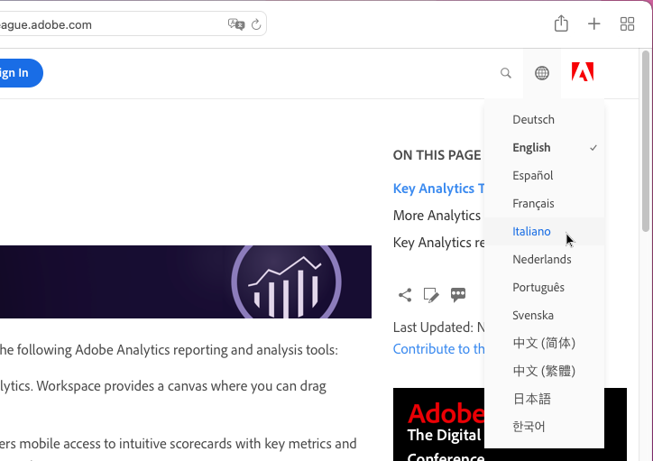
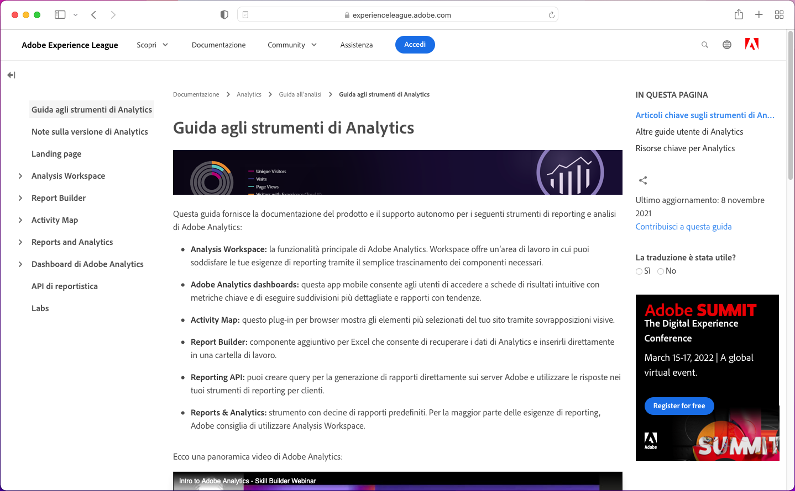
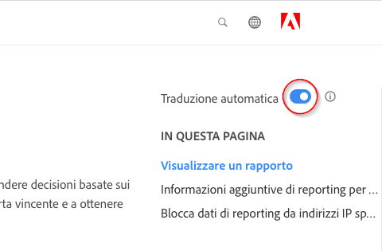
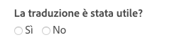

# Supporto linguistico per la documentazione di prodotto Adobe Experience Cloud

Adobe è consapevole del fatto che i clienti si aspettano che la documentazione di prodotto, le guide e il contenuto di supporto siano subito disponibili nelle lingue supportate dai prodotti Adobe. Per realizzare questo obiettivo, Adobe offre un’esperienza di traduzione unica che consente di selezionare la lingua desiderata e di fornire un feedback sulla qualità dei contenuti tradotti.

## Selezione di una lingua

Puoi visualizzare la documentazione di prodotto di Adobe Experience Cloud in molte lingue.

1. Passa alla [documentazione prodotto](https://helpx.adobe.com/it/support/experience-cloud.html) di Experience Cloud.

1. Sfoglia per trovare la pagina della guida (ad esempio, [Analytics](https://docs.adobe.com/content/help/it-IT/analytics/landing/home.html)).

1. Fai clic sul Selettore lingua (icona a forma di mondo), quindi scegli una lingua.

   

   La pagina viene visualizzata nella lingua selezionata.

   

   Nel caso in cui la versione nella tua lingua non è ancora disponibile, Adobe può tradurre automaticamente i contenuti. Il servizio di traduzione automatica Adobe mostra un messaggio nella parte superiore dell’area di navigazione a destra:

   

   Il contenuto può essere reso automaticamente nella tua lingua, oppure puoi cliccare su un link per attivare la traduzione. (Questo può verificarsi quando si clicca sul collegamento ipertestuale per tornare alla pagina originale in inglese dalla pagina tradotta. Ti dà la possibilità di visualizzare la pagina tradotta su richiesta.) In qualsiasi momento è possibile tornare alla pagina originale in inglese.

   Talvolta, il contenuto originale in inglese potrebbe essere stato aggiornato di recente e pubblicato prima che le traduzioni fossero state completate. Facendo clic sulla lingua nel menu a discesa, verrà visualizzata una notifica nella barra orizzontale azzurra all’inizio della pagina. Tale notifica informa che la pagina è stata tradotta automaticamente a partire dalla versione precedente, con contenuto aggiornato disponibile a breve. Puoi scegliere se visualizzare il contenuto originale in inglese più recente in una nuova finestra del browser.

## Perché utilizzare la traduzione automatica

Adobe sfrutta le potenzialità della traduzione automatica per pubblicare contenuti di supporto dei prodotti in diverse lingue, in tempi più brevi possibili rispetto alla creazione dei contenuti stessi. Poiché i contenuti di supporto sono fondamentali per l’utilizzo del prodotto, diamo la priorità alla traduzione di contenuti da parte di professionisti qualificati, ma possiamo anche optare per la traduzione automatica dove la velocità e l’urgenza contano di più.

La traduzione automatica è onnipresente su Internet e il suo utilizzo è generalmente accettato come un potente strumento di raccolta delle informazioni. È stata ampiamente adottata per i contenuti con base di conoscenza, dove l’intervento umano risulta poco o per niente necessario. Anche se negli ultimi anni sono stati compiuti importanti progressi tecnologici, le traduzioni generate automaticamente possono contenere imprecisioni ed errori di linguaggio e significato sporadici.

### Traduzione automatica tramite il browser

Se hai impostato le preferenze del tuo browser in modo da tradurre automaticamente qualsiasi pagina nella tua lingua, le traduzioni risultanti saranno diverse da quelle ottenute attraverso la pagina Adobe. Questo perché il servizio offerto dal browser potrebbe consistere di traduzioni in serie, mentre le traduzioni Adobe sono personalizzate in base alle linee guida e alla terminologia di Adobe. Per ottenere risultati di traduzione automatica ottimali, ti consigliamo di disabilitare l’opzione del browser per questo sito specifico nelle preferenze del browser, oppure di fare clic su **Non tradurre** quando visualizzato.

### Problemi noti

Talvolta potrebbero verificarsi problemi con il rendimento della traduzione automatica, ad esempio traduzioni incomplete, caratteri danneggiati o problemi di layout della pagina. Questi sono dovuti a vari strumenti di scrittura, pubblicazione o traduzione utilizzati da Adobe. Faremo tutto il possibile per elencare i problemi noti qui di seguito.

| **ID PROBLEMA** | **DESCRIZIONE** | **STATO** |
|--------------|-------------------------------------------------------------------------------------|------------|
| G11N3558 | Alcune pagine di Audience Manager sono visualizzate per metà in inglese e per metà tradotte (francese, spagnolo). | APERTO |

### Feedback

Quando il contenuto viene tradotto automaticamente, per impostazione predefinita o per scelta dell’utente, è possibile fornire ad Adobe un feedback sulle traduzioni. Nella
barra orizzontale azzurra nella parte superiore della pagina, puoi rispondere “Sì” o “No” alla domanda: “Questa traduzione è stata utile?”. Adobe raccoglie quest’informazione
e analizza i dati compilati per prendere decisioni sulla traduzione dei contenuti. Apprezziamo il tuo feedback e ti incoraggiamo a rispondere.

In futuro, consentiremo di fornire feedback più approfonditi, sotto forma di segnalazione di problemi, proposte di miglioramenti e persino richieste
di ulteriori lingue. Alcune di queste funzioni sono già disponibili nelle pagine in inglese. A lungo termine, crediamo che questo aiuterà Adobe a migliorare
l’esperienza utente sulle sue pagine.

<!--

-->

### Dichiarazione di non responsabilità sulla traduzione

Adobe utilizza un programma di traduzione automatica per tradurre il testo in diverse lingue. Le traduzioni informatizzate sono traduzioni letterali e potrebbero contenere errori. Adobe non garantisce l&#39;accuratezza, affidabilità o tempestività delle traduzioni fornite. Adobe non si riterrà responsabile di eventuali perdite o danni subiti a causa dell&#39;affidabilità o dell&#39;accuratezza delle informazioni tradotte. Se ci sono differenze tra l&#39;inglese e un&#39;altra lingua, fai riferimento alla versione in inglese.

Se desideri segnalare un errore di traduzione o un errore di imprecisione, ti invitiamo a contattarci.
