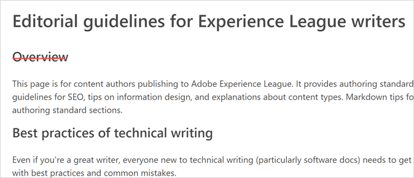

# Linee guida sullo stile di authoring per i collaboratori esterni {#guidelines}

Questa pagina fornisce linee guida editoriali per gli autori esterni che creano contenuti o aggiornano contenuti esistenti su Experience League. Prima di iniziare:

* Acquisisci familiarità con l’authoring [Markdown](markdown.md).
* Controlla l’ortografia e la grammatica degli articoli.
* Utilizza un tono amichevole, una presentazione coerente e frasi semplici per migliorare la traduzione automatica.
* Segui le [best practice](#writing-tips) e gli standard editoriali in questa pagina.

## Linee guida di stile {#style-guidelines}

Tieni presente quanto segue durante la scrittura della documentazione.

* **Scrivi in modo sintetico**: non sprecare parole. Mantieni le frasi brevi e concise. Mantieni l’articolo mirato. Mantieni al minimo il numero di note.
* **Concentrati sul pubblico e sullo scopo**: prima di iniziare a scrivere, stabilisci chiaramente chi sia il cliente e quale attività sta tentando di svolgere. Scrivi l’articolo per aiutare il cliente a svolgere quell’attività.
* **Utilizza esempi**: fornisci esempi per spiegare i concetti.
* **Organizza i contenuti**: crea delle sezioni per suddividere le istruzioni in gruppi di passaggi più gestibili. Aggiungi una schermata quando serve per maggiore chiarezza.

## Best practice per la scrittura tecnica {#writing-tips}

La scrittura tecnica, in particolare per la documentazione software, è un settore specializzato. Persino il romanziere più prolifico entra in agitazione al momento di affrontare la scrittura tecnica, non perché il materiale sia complesso o tecnico, ma perché non è facile _semplicare_ informazioni tecniche e complesse. Per avere successo, il contenuto deve essere strutturalmente coerente, analizzabile, riutilizzabile e passare lungo la pipeline di pubblicazione senza errori di struttura e sintassi.

Le sezioni seguenti descrivono i problemi comuni a cui i nuovi autori devono prestare attenzione:

### Titoli non separati da testo (doppio titolo) {#double-headings}

Se sono presenti due titoli consecutivi, senza alcun testo che li separi, aggiungi del testo che introduca il secondo titolo. In alternativa, puoi rimuovere uno dei due titoli. È probabile che il secondo sia superfluo.

Ad esempio, _Panoramica_ qui non ha uno scopo:

* Inoltre, se il secondo titolo è _Panoramica_, probabilmente è superfluo. Il primo titolo H1 e il primo paragrafo fungono da panoramica concettuale sull’argomento dell’articolo.

* Analogamente, ai fini SEO, titoli isolati come _Panoramica_ e _Introduzione_ non sono, di per sé, utili. Nomina il prodotto o la funzione che stai presentando. (Esempio: _Panoramica dei rapporti di fallout_)

### Tiitoli di riferimenti incrociati incoerenti {#maps}

Utilizza il titolo _Ulteriori informazioni_ per introdurre un elenco di riferimenti incrociati (o mappe). Esempio:

**Linee guida per elenchi di riferimenti incrociati**

* Utilizza un elenco puntato per i riferimenti incrociati.
* Usa il corsivo per i nomi formali delle guide o delle pagine (quando non utilizzi testo con collegamento).
* Non inserire punteggiatura nel titolo (valido per tutti i titoli).
* Evita di inserire numeri nei titoli.

### Voce di sommario, breadcrumb e nome della pagina non corrispondenti {#toc}

Poiché gestiamo manualmente il file del sommario, queste mancate corrispondenze sono errori comuni. Assicurati che ogni voce del sommario corrisponda al nome della relativa pagina, ossia al suo titolo H1. Inoltre, assicurati che corrisponda strettamente al breadcrumb.

**Linee guida per sommari e elenchi**

* In alcuni casi potrebbe essere necessario ridurre la voce del sommario, che dovrà comunque restare chiaramente correlata al nome della pagina e alla breadcrumb.
* Le breadcrumb vengono estratte dai metadati del titolo, e quindi possono essere diverse (a scopo di SEO).

### Virgolette invece del corsivo {#quotes}

È difficile resistere all’aggiunta di virgolette intorno a una parola o un’espressione. Tuttavia, le virgolette sono destinate a citazioni e non sono quasi mai utilizzate nella documentazione del prodotto.

**Linee guida sull’uso delle virgolette**

* Di solito il corsivo funziona meglio delle virgolette (per messaggi di errore, termini particolari o stranieri e così via).
* Per gli elementi dell’interfaccia, utilizza il grassetto e UICONTROL.

### Procedure {#steps}

La capacità di scrivere una procedura (contenuti di tipo _attività_) non è un talento innato. Ma con la pratica è possibile scrivere una procedura chiara e leggibile.

**Linee guida per i passaggi**

* Una procedura consiste in una serie di passaggi. Ogni passaggio è composto da un comando breve, numerato, _a frase singola_.
* Inizia ogni passaggio con un verbo o con _Per_ + infinito (per orientare il lettore verso l&#39;obiettivo, ad esempio _Per mantenere l’accesso, seleziona **Resta connesso**_). Se un passaggio ha un obiettivo specifico nell’ambito della procedura generale, indica l’obiettivo prima dell’azione.
* Per aggiungere informazioni sul passaggio (contenuti di tipo _informazioni sul passaggio_, aggiungilo dopo il passaggio (rientrato rispetto al passaggio ) o dopo la risorsa (che può essere una schermata, un video o un elenco di descrizioni dell’interfaccia).
* Se il passaggio include due azioni, ad esempio _Seleziona A, quindi B_, scrivila come una singola, breve frase.
* Limita ogni attività a circa 7-10 passaggi. Se si creano più di dieci passaggi in un’attività, è probabile che sia necessario suddividerla in due attività. In casi simili, adotta l&#39;approccio che ritieni più appropriato.
* Nella documentazione del prodotto, non utilizzare i titoli come passaggi. (Eccezione riportata di seguito per i tutorial.)
* Per i tutorial su più pagine, è possibile utilizzare i titoli come passaggi. Tuttavia, in questo caso non devono essere numerati. Piuttosto, scrivi per intero _Passaggio 1:_, _Passaggio 2:_ e così via.

**Procedura di esempio**

Di seguito è riportata una procedura ben strutturata su come accedere ad Adobe:

Per accedere ad Adobe:

1. In `Adobe.com`, seleziona **Experience Cloud**.
1. Seleziona **Accedi**.
1. Seleziona **Account personale**.
1. Per restare connesso, seleziona **Resta connesso**.
1. Digita il tuo nome e la tua password.
1. Seleziona **Accedi**.

### Elenchi paralleli {#lists}

L’utilizzo di una costruzione parallela per gli elenchi facilita la lettura e la scansione. Gli elenchi includono un sommario, elenchi puntati (non ordinati) o elenchi numerati.

Esempio di sommario con voci parallele:

Il sommario precedente è un buon esempio perché:

* Le voci principali concettuali sono sostantivi o frasi sostantivali.
* Le procedure (attività) sono verbi attivi (non al gerundio).
* Tutte le voci iniziano con lettera maiuscola.

## Metadati di titolo e descrizione {#metadata}

I metadati di _titolo_ e _descrizione_ sono importanti per SEO (Search Engine Optimization), l’individuazione dei contenuti e i punteggi di qualità dei contenuti in Experience League.

Di seguito sono riportati alcuni esempi di titoli e descrizioni:

**Descrizioni per articoli su concetti**

* _Scopri di più sui segmenti in Adobe Analytics. Ottieni aiuto per la configurazione del pannello Segmentazione in un’area di lavoro._
* _Trova informazioni sull’utilizzo dei segmenti in un rapporto Visualizzazioni pagina in Adobe Analytics._

**Descrizioni per articoli su procedure/attività**

* _Scopri come creare un segmento in Adobe Analytics._
* _Crea un segmento in Adobe Analytics. Scopri come selezionare, configurare ed eseguire un rapporto basato sul segmento creato._

La forma che utilizzi dipende dalla lunghezza e dall’ambito dell’articolo.

**Titolo per un articolo su concetti**

* _Segmenti nei rapporti Visualizzazioni pagina_

**Titolo per un articolo su procedure/attività**

* _Creare un segmento per un rapporto Visualizzazioni pagina_

(Ricorda che il carattere barra verticale e il nome del prodotto vengono aggiunti automaticamente ai titoli).

## Modi per migliorare la chiarezza (e i punteggi Acrolinx) {#tips}

Di seguito sono riportati metodi semplici per migliorare la progettazione, la chiarezza e la leggibilità dei contenuti. Questi contribuiscono anche a migliorare i punteggi di stile Acrolinx e i punteggi CQI in ExL.

| Linee guida | Informazioni |
|---|---|
| Usa la forma attiva | Cambia la forma passiva in forma attiva |
| Usa il presente | **Debole:** *Campaign v8 verrà rilasciato a giugno.* 
**Forte:** *Campaign v8 arriva a giugno.*
Il presente è sempre più facile da leggere. |
| Evita avverbi deboli e inutili | *Molto*, *estremamente*, *incredibilmente*... 
Gli avverbi sono parole aggiuntive che non aggiungono un significato importante se si utilizzano verbi, periodi e aggettivi forti e precisi. |
| Usa verbi forti nei titoli e nelle [voci del sommario](#using-toc) | Esempi:
**Debole:** *Creazione e gestione delle caratteristiche* 
**Forte:** *Creare e gestire le caratteristiche* |
| Usa l&#39;iniziale [lmaiuscola](https://docs.microsoft.com/it-it/style-guide/capitalization) solo nella prima parola | Nel dubbio, non scrivere con l’iniziale maiuscola. Nei titoli, utilizza l’iniziale maiuscola solo per la prima parola. Utilizza l’iniziale maiuscole nei sostantivi propri. Nelle procedure, utilizza le iniziali maiuscole esattamente come sono riportate nell’interfaccia. |
| Ricorda questi piccoli suggerimenti per chiarezza | <ul><li>Evita di usare *Al fine di* (non aggiunge alcun significato). È sufficiente *Per.*</li><li>Evita *Utilizzare.* Potrebbe sembrare più tecnico, ma non lo è. *Utilizzare* significa *fare buon uso di qualcosa, soprattutto di qualcosa che non era destinato allo scopo ma risulterà utile*.</li><li>Evita i punti e virgola: utilizza piuttosto un punto e inizia una nuova frase. I punti e virgola presentano una complessità inutile.</li><li>Due punti: usa i due punti per introdurre un elenco. Usa i due punti con moderazione all’interno delle frasi. Usa la maiuscola nella prima parola dopo due punti seguiti da un a capo.</li><li>Usa la virgola seriale (tre virgole in un elenco).</li><li>Mantieni la lunghezza della frase sotto le 39 parole.</li><li>Navigazione: usa _vai a_ o _passa a_.</li><li>Evita il testo non elaborato dell’URL (usa testo di collegamento intuitivo), a meno che la visualizzazione del percorso completo non rappresenti un’informazione importante.</li></ul> |
| Utilizza un controllo ortografico in VSC | Installa Code Spell Check (estensione) in Visual Studio Code. |
| Cambia _fai clic su_ in _vai a_ o _seleziona_. | Il termine _clic_ fa riferimento a uno specifico dispositivo (che presenta problemi di accessibilità) e ora si tende a non utilizzarlo più. Di seguito sono riportati alcuni suggerimenti per formule alternative:<ul><li>Navigazione: _Vai a File > Stampa_.</li><li>Fare clic: _Seleziona File > Stampa_ o _Seleziona OK_. </li></ul>Per ulteriori idee sulla scelta migliore dei termini in varie situazioni, vedi [Descrizione delle interazioni con l’interfaccia utente](https://docs.microsoft.com/it-it/style-guide/procedures-instructions/describing-interactions-with-ui). |
| Esegui Acrolinx in VSC | Acrolinx verifica la presenza di problemi di stile e grammatica. Controlla gli URL, la terminologia, l’ortografia e altro ancora. Consente di migliorare la chiarezza e la traduzione dei contenuti di Experience League. |

{style="table-layout:auto"}

Altre best practice e risorse:

* [Contenuto riconoscibile a colpo d’occhio](https://docs.microsoft.com/it-it/style-guide/scannable-content/): aiuta i lettori a trovare rapidamente ciò di cui hanno bisogno o a riconoscerlo altrettanto rapidamente quando si trovano su altre pagine. Può essere utile scrivere i contenuti in modo da facilitarne la lettura a colpo d’occhio.
* **Numeri:** nel corpo del testo, scrivi in lettere i numeri interi da zero a nove e utilizza le cifre per i numeri da 10 in su. Vedi [Numeri](https://docs.microsoft.com/it-it/style-guide/numbers).
* Scrivi come parli, in tono cordiale, e arriva rapidamente al punto.

Per ulteriori informazioni, vedi [Primi 10 suggerimenti per la scrittura](https://docs.microsoft.com/it-it/style-guide/top-10-tips-style-voice) nella [Guida allo stile di Microsoft®](https://docs.microsoft.com/it-it/style-guide/welcome/).

## Testo alternativo {#alt-text}

Aggiungi testo alternativo significativo alle risorse (immagini). Considera testo alternativo che corrispondenta a:

* L’obiettivo che i clienti possono raggiungere (nome dell’attività o del concetto)
* Funzione o pagina che stai mostrando
* Nome dell’icona che stai mostrando

Google considera il testo alternativo nei risultati SEO (Search Engine Optimization).

## Localizzazione - DNL e UICONTROL {#localization}

Non devi preoccuparti di sapere se il tuo prodotto è localizzato o quali sono le lingue utilizzate da ExL. Tuttavia, puoi contribuire a migliorare la qualità della localizzazione applicando i due tag Markdown seguenti (necessari), se appropriato:

* `DNL`

  DNL significa _do not localize_ (non localizzare). Lo si utilizza solo per i nomi di prodotti Adobe con marchio registrato, che devono rimanere sempre in inglese.

  Esempi di sintassi: `[!DNL Adobe Campaign]` o `[!DNL Workfront]`

  DNL non deve essere usato per nomi di file o URL.

* `UICONTROL`

  UICONTROL indica un controllo dell’interfaccia (ad esempio un’opzione, un campo, una scheda, una pagina, un gruppo di opzioni o il nome di una funzione nell’interfaccia utente).

  Esempio di sintassi: `Select **[!UICONTROL Project]**, then select **[!UICONTROL Save]**.`

>[!IMPORTANT]
>
>È necessario applicare questi tag prima di localizzare il contenuto.

### Utilizzo di Adobe nei nomi dei prodotti {#product-names}

Per l’identità aziendale, di solito includiamo _Adobe_ nel primo riferimento di un prodotto a livello di guida. A seconda dello spazio, è possibile omettere Adobe in un titolo, ma il primo riferimento nel corpo del testo deve includere il nome completo. Alcuni prodotti, come _Adobe Audition_ e _Adobe Premiere Pro_, richiedono l’uso di Adobe nel primo riferimento o in quello più importante in ogni documento, in quanto fa parte del nome legale, marchio di fabbrica.

## Primi paragrafi {#firstparas}

Il primo paragrafo deve definire l’argomento e descrivere ciò che il lettore apprende dalla lettura dell’articolo.

Primo paragrafo di esempio (concetto):

_I tipi di pubblico sono raccolte di visitatori (un elenco di ID visitatore). Il servizio Audience di Adobe gestisce la trasformazione dei dati dei visitatori in segmentazione del pubblico. La creazione e la gestione dei tipi di pubblico sono simili alla creazione e all’uso dei segmenti e in più permettono di condividere i segmenti di pubblico in Experience Cloud._

Primo paragrafo di esempio (attività):

_Creazione della sorgente attributo cliente (file CSV e FIN) e caricamento dei dati. Puoi attivare l&#39;origine dati quando lo desideri. Una volta che l&#39;origine dati è attiva, condividere i dati degli attributi con Analytics e Target._

### Suggerimenti SEO per i primi paragrafi {#seo}

* Includi i termini di ricerca nei primi paragrafi.
* Utilizza i termini utilizzati anche dai lettori.
* Includi i sinonimi e, se necessario, eventuali termini precedenti non più in uso. Ad esempio, “Il Servizio Experience Cloud ID (ECID), noto in precedenza come _ID visitatore_ o con acronimi come MID, MCVID, fornisce un ID universale e costante che identifica i visitatori.”
* Includi termini SEO nei collegamenti.
* Evita di inserire termini essenziali in tabelle complesse. Le tabelle complesse non producono risultati di ricerca affidabili. Il testo nelle immagini non è incluso nelle ricerche. Le didascalie sono incluse nelle ricerche.

## Uso delle maiuscole {#capitalization}

* Lo stile di Adobe prevede l’iniziale maiuscola solo per la prima parola di titoli, sottotitoli ed elementi di navigazione della pagina.
* Tutte le parole sono in minuscolo, a eccezione della prima parola e di eventuali nomi propri, come i nomi di marchi, soluzioni e servizi.
* Per i nomi di strumenti, opzioni, voci di menu, finestre di dialogo e campi dei prodotti, assicurati di usare le stesse maiuscole/minuscole usate nell&#39;interfaccia del prodotto stesso.

## Sommario {#using-toc}

Il `TOC.md` è il sommario. Ogni guida dovrebbe averne uno.

**Linee guida editoriali per un sommario**

* Uso delle lettere maiuscole: utilizza sempre la maiuscola a inizio frase per ogni voce (esclusi gli acronimi). Usa l’iniziale maiuscola solo per i nomi dei prodotti formali o per gli elementi dell’interfaccia (pagine, schede, campi, opzioni e così via). Quando fai riferimento a un elemento dell’interfaccia utente, ssa la stessa forma utilizzata nell’interfaccia essa.
* Forma del verbo e parallelismo: usa il verbo imperativo ed evita i gerundi. Il sommario è un elenco, quindi cerca sempre di usare elenchi paralleli nella maggior parte dei casi. Ci sono eccezioni che a volte non possono essere evitate. Per le pagine concettuali, utilizza sostantivi e sintagmi nominali. Per le attività, utilizza i verbi.

**Linee guida per la sintassi**

* Un titolo di sezione (principale) nel sommario non può essere un collegamento, in quanto non vi è associata direttamente una pagina con contenuto. Deve quindi contenere un ancoraggio come `{#processing-rules}`.
* Utilizza la sintassi corretta per i titoli di sezione nel sommario (ad esempio, `+ Processing rules {#processing-rules}`) e per i collegamenti agli articoli (ad esempio, `+ [Article name](article.md)`).
* Le voci di articolo del sommario possono essere una versione ridotta del titolo effettuvo dell’articolo. Segui gli standard per la scrittura di panoramiche, concetti e attività contenuti in questo documento.
* Evita di aggiungere lo stesso file più volte a un sommario (o a più sommari). Questo potrebbe causare comportamenti imprevisti.
* Se il repository contiene più guide utente, le directory della guida utente devono trovarsi allo stesso livello, ad esempio le sottodirectory all’interno della directory `help`. Ogni directory della guida utente deve disporre di un file TOC con il sommario. Le guide utente non devono essere nidificate.

## Grassetto e corsivo {#bold}

* Utilizza il testo in grassetto solo per gli elementi dell&#39;interfaccia utente su cui si fa clic in una procedura (e contrassegnati con UICONTROL).
* Utilizza il corsivo per enfasi o quando una parola potrebbe risultare ambigua, ad esempio per una parola straniera oppure per descrivere una parola o definire un termine.
